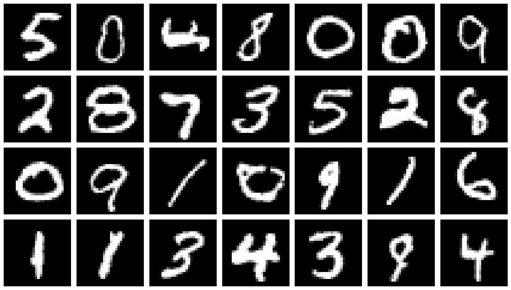
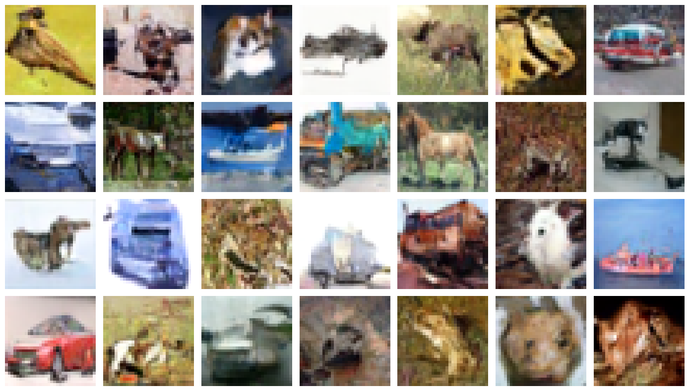

# Reproducing the Denoising Diffusion Probabilistic Model
This project aims to re-implement the Denoising Diffusion Probabilistic Model (DDPM) in PyTorch, following the original paper: https://arxiv.org/abs/2006.11239. 
The results will be reproduced on MNIST and CIFAR10. 

The project is conducted as part of the course in Deep Learning at the Technical University of Denmark. 

The notebook `main_notebook.ipynb` contains the notebook which reproduces main results. Link: [main_notebook.ipynb](./main_notebook.ipynb). 
However, please note that we could not run the models in full on our local machines (we used the HPC system for the main results), and as such, the models have only been run for a few epochs in this notebook. Please see the additional comments in the top of the notebook. 

  

  

